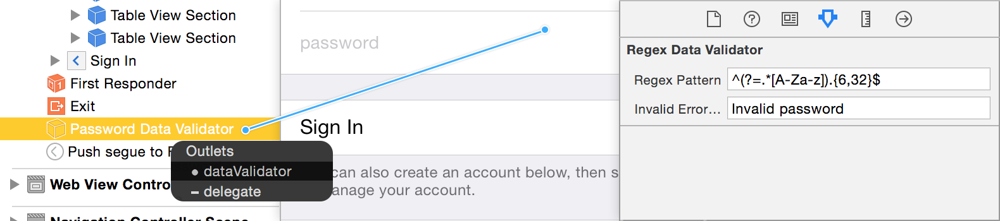

# Warrant

[](https://travis-ci.org/shaps80/Warrant)
[](http://cocoadocs.org/docsets/Warrant)
[](http://cocoadocs.org/docsets/Warrany)
[](http://cocoadocs.org/docsets/Warrant)



Data validation made easy. In code and from Interface Builder.

Warrant aims to remove validation from your code, centralize common validation patterns and make your validations more compositable.

Warrant makes data validation better by following best practices:

* Single Responsibility Principle
* Separation of Concerns
* Composition
* Reusability

## Validators

Warrant provides four validators by default:

* RegexValidator
* EmailValidator
* BlockValidator
* CompoundValidator (using `.All` or `.Any` rules)

Validators also use Swift's new error handling features, making it easy to use in code.

## View Validators

Warrant also provides validation support for three view types by default:

* UITextField
* UITextView
* UITableViewCell
* UIButton

Warrant also makes use of `@IBInspectable`, giving you access to common configuration options through IB.

See the example app or the screenshot above to learn how you can use this feature.

## Dependencies

Warrant even supports dependant fields. So with zero code, you can configure a view to validate based on its validator in addition to other dependant views. See the example Sign In app to see how this works.

## Extending Warrant

Warrant follows a protocol oriented approach, making it easy to add your own validators.

If you want to create a new validator, you can either comform to the `Validating` protocol or subclass `Validator` (recommended) directly.

If instead you want extend a UIView (or subclass) to support validation, you just need to make it conform to `ViewValidating`. Now you can use it from code or IB and gain all the benefits and power from Warrant.
	
## Code

If you prefer to setup your validators in code:

``` swift
let validator = EmailValidator()
validator.regexPattern = ...
do {
  validator.validate(email)
} catch { print(error) }
```

If you want to configure a view with depenedencies, you can set that up like so:

```swift
button.dependantViews = [ emailField, passField ]
```

Validation is then as simple as:

```swift
do {
  try button.validate()
} catch { print(error) }
```

## Compound Validators

What if we want to apply multiple validators for a value? Easy, we can either use a compound validator:

```swift
let nonEmpty = NonEmptyValidator()
let email = EmailValidator()
    
let compound = CompoundValidator(validators: [ nonEmpty, email ])
do {
  try compound.validators?.validate("foor@bar.com", rule: .All)
} catch { print(error) }
```

or we use a straight Swift array:

```swift
let validators = [ nonEmpty, email ]
validators.validate("foo.bar@me.com", rule: .All)
```

CompoundValidator are better when configuring via Interface Builder.

_Note: You can also validate multiple views in this way_

## Installation

Warrant is available through [CocoaPods](http://cocoapods.org). To install
it, simply add the following line to your Podfile:

    pod 'Warrant'
    
## Pull Requests

If you have ideas for really useful, reusable validators, please create a pull request and I'll include them.

When designing your validators remember these basic rules:

## Author

Shaps Mohsenin, [@shaps](http://twitter.com/shaps)

## License

SPXDataValidators is available under the MIT license. See the LICENSE file for more info.

